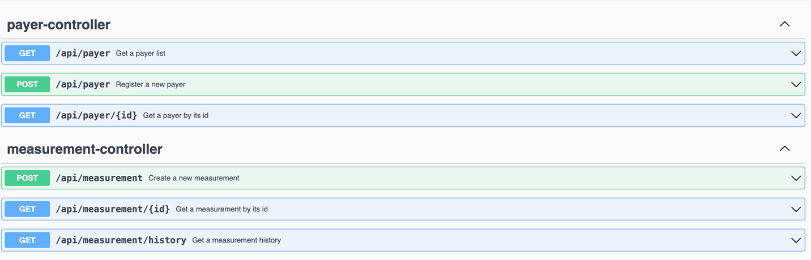

# Gas & Water Usage Monitoring Application

### Endpoints:

### Swagger URL - http://localhost:8080/swagger-ui/index.html#/
### API Docs: http://localhost:8080/v3/api-docs

### How to run application?
- docker-compose up --build
- mvn clean install -> run Spring Boot Application